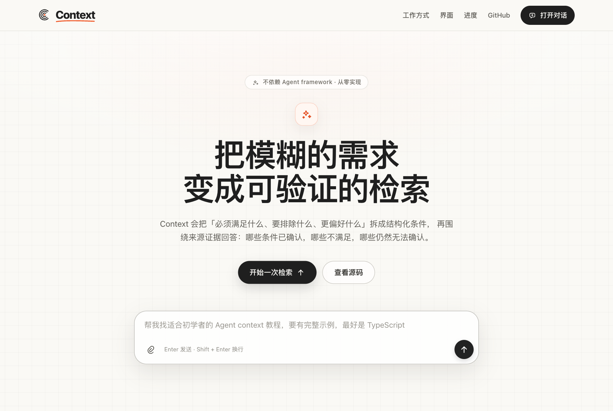
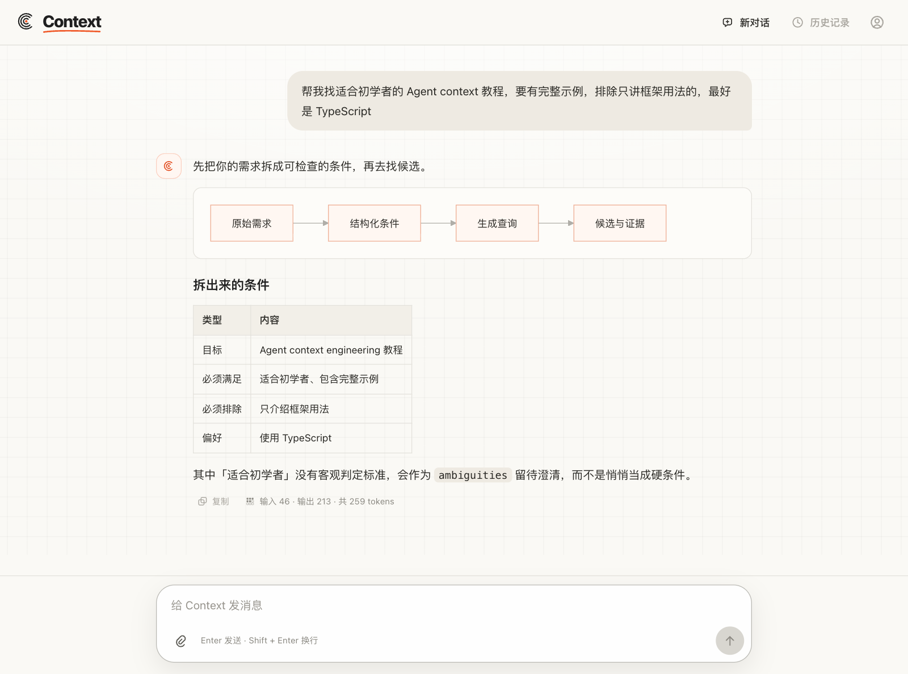

# Context

[](README.md)
[](README.zh-CN.md)

A context-centered retrieval agent, built from scratch without an agent framework.

It tries to turn vague asks like *"find me things that match these conditions"* into a retrieval
process that is executable, traceable, and verifiable. The point of the project is to understand
model protocols, tool calling, the agent loop, context selection, and evidence handling in real
code — not to wire up a library that hides them.



## Why this project

Keyword search matches strings. What people actually mean is usually a goal made of several
conditions at once:

> I want something of this kind, it must have these properties, it must not have those,
> and ideally it also satisfies a few preferences.

Context works toward that whole chain: understand the request, generate queries, fetch candidates,
check constraints, re-rank on evidence, and finally explain why each result matches — and which
parts still cannot be confirmed.

```text
user request
  → parse goal, hard constraints, exclusions, soft preferences
  → generate and refine search queries
  → search and read public web pages
  → normalize, filter, and re-rank candidates
  → build a bounded evidence context
  → return results, match reasons, sources, and open questions
```

## What works today




**Retrieval groundwork**

- `retrievalIntentSchema`: a strict zod schema for goal, hard constraints, exclusions, soft
  preferences, and ambiguities.
- `extractRetrievalIntent()`: a real DeepSeek call in JSON mode whose output is validated against
  that schema. The model client is injectable, so the tests run without a network call.
- A tool contract for search (`zod` → JSON Schema) plus a dispatcher that validates arguments
  before calling a tool.

## What does not work yet

Be clear about the gap: **there is still no real internet retrieval.**

- `search()` deliberately throws `Search is not implemented` — only the contract exists.
- Intent extraction is a tested module, not yet wired into the chat route.
- No page reading, no agent loop, no candidate filtering, no evidence context.

Those land one small step at a time, each with its own tests.

## Context design

Context does not treat context as an ever-growing chat log. It maintains four bounded kinds of
state instead:

- **Request context** — what the user is looking for, and the current task goal.
- **Constraint context** — what must hold, what must be excluded, what is merely preferred, and
  what still needs clarifying.
- **Retrieval context** — queries already used, candidates found, and why some were dropped.
- **Evidence context** — the source snippets backing candidate properties and final conclusions.

A description the model wrote is not a fact. Any property that cannot be confirmed from a source
must be marked unknown; guessing to satisfy a constraint is not allowed.

## Quick start

### Requirements

- Node.js 22+
- pnpm 11+
- A DeepSeek API key

### Run locally

```bash
git clone https://github.com/slince-zero/ai-agent-pro.git
cd ai-agent-pro
pnpm install
cp packages/server/.env.example packages/server/.env

# edit packages/server/.env and paste your DeepSeek API key

pnpm dev
```

Then open [http://localhost:5173](http://localhost:5173). The dev server proxies `/api` to
`http://127.0.0.1:3001`. Set `PORT` to run the client on a different port.

> The env var keeps the OpenAI SDK name `OPENAI_API_KEY`, but requests go to the DeepSeek API.

## Commands

```bash
pnpm dev        # start client and server together
pnpm test       # run tests
pnpm typecheck  # TypeScript type check
pnpm lint:ci    # lint + format check
pnpm build      # build every workspace package
```

## Project structure

```text
packages/
  client/
    src/App.tsx              chat view: streaming, paced reveal, usage, stop/retry
    src/landing/             landing page sections
    src/markdown.tsx         Markdown pipeline: GFM, sanitized raw HTML, image fallback
    src/mermaid-diagram.tsx  lazily loaded mermaid renderer with an error boundary
    src/streaming-markdown.ts closes half-written syntax while streaming
    src/icons/               hand-drawn icon set (gallery at /?icons)
    src/util.ts              NDJSON stream consumer
  server/
    src/app.ts               Express routes and request validation
    src/agent.ts             DeepSeek streaming agent core
    src/retrieval/           retrieval-intent schema and extraction
    src/tools/               tool contracts and the dispatcher
  shared/
    type.ts                  message and stream-event types shared by both sides
docs/
  product-plan.md            scope, order of work, acceptance criteria
  learning-contract.md       the learning-first working agreement
  decisions/                 architecture decision records
```

## Roadmap

- [x] Streaming chat pipeline with token accounting
- [x] Markdown, mermaid, and sanitized raw HTML rendering
- [x] Structured retrieval intent: goal, hard constraints, exclusions, soft preferences
- [ ] Search tool with a unified result type
- [ ] Page fetching and main-content extraction
- [ ] Raw tool-call protocol and the agent loop
- [ ] Candidate filtering, evidence selection, explainable re-ranking
- [ ] Adding, changing, or revoking constraints across turns

Full plan and per-stage acceptance criteria: [product plan](docs/product-plan.md).

## Development principles

- Start from raw protocols and loops; no agent framework hiding the data flow.
- Solve one clear learning question at a time, and verify it with a test.
- Keywords and deterministic filters first; reach for heavier retrieval techniques only when a
  real problem demands them.
- Conclusions must be backed by sources wherever possible. Unknown stays unknown.
- One issue, one PR, and every capability records its assumptions, limits, tests, observed
  failures, and results.

Details: [AGENTS.md](AGENTS.md) and the [learning contract](docs/learning-contract.md).

The earlier AI-generated product code is kept at the Git tag
[`v1-ai-generated`](https://github.com/slince-zero/ai-agent-pro/tree/v1-ai-generated); the current
version does not copy that architecture.

## License

[MIT](LICENSE)

