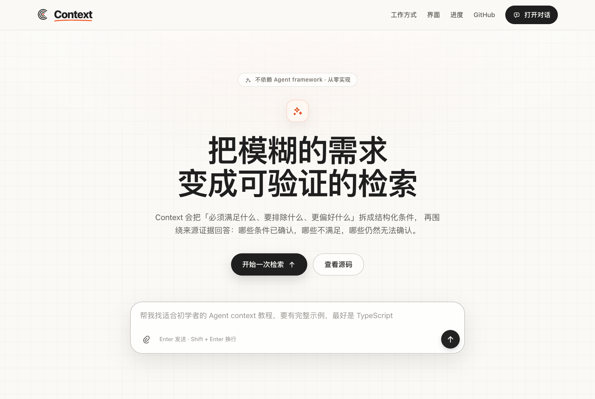
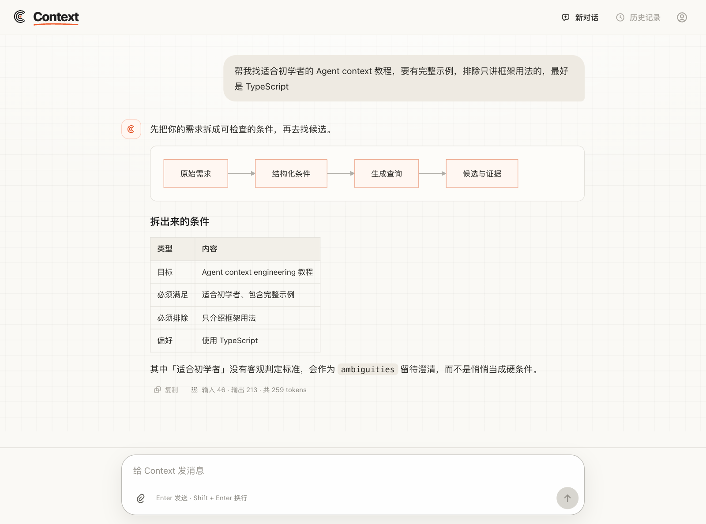

# Context

[](README.md)
[](README.zh-CN.md)

A context-centered retrieval agent, built from scratch without an agent framework.

It tries to turn vague asks like _"find me things that match these conditions"_ into a retrieval
process that is executable, traceable, and verifiable. The point of the project is to understand
model protocols, tool calling, the agent loop, context selection, and evidence handling in real
code — not to wire up a library that hides them.



## Why this project

Keyword search matches strings. What people actually mean is usually a goal made of several
conditions at once:

> I want something of this kind, it must have these properties, it must not have those,
> and ideally it also satisfies a few preferences.

Context works toward that whole chain: understand the request, generate queries, fetch candidates,
check constraints, re-rank on evidence, and finally explain why each result matches — and which
parts still cannot be confirmed.

```text
user request
  → parse goal, hard constraints, exclusions, soft preferences
  → generate and refine search queries
  → search and read public web pages
  → normalize, filter, and re-rank candidates
  → build a bounded evidence context
  → return results, match reasons, sources, and open questions
```

## What works today



Each question runs this path: `POST /api/questions/stream` → resolve the current task and
conditions → clarify, chat, or retrieve → validate the answer → an NDJSON event stream back to the UI.

**Retrieval intent**

- `retrievalIntentSchema`: a strict zod schema for goal, hard constraints, exclusions, soft
  preferences, and ambiguities.
- `resolveRetrievalTask()`: DeepSeek in JSON mode (thinking disabled) reconstructs current
  conditions on every turn. Explicit new-task instructions cut off old context; ambiguous
  conditions trigger clarification, and ordinary conversation runs without tools.
- `extractRetrievalIntent()` remains an independently tested single-question learning helper.
- `buildSearchQueries()`: seed queries from the intent; exclusions and ambiguities stay out.
- `updateRetrievalIntent()` remains a tested patch helper. The chat route reconstructs the full
  intent from history instead of accepting client-supplied state or storing server sessions.

**Tools**

- `search`: Tavily Search, at most 5 hits per call, 8 s timeout.
- `read_page`: Tavily Extract, markdown body capped at 20 000 characters, 12 s timeout.
- `executeTool()`: validates arguments with zod before running. Bad arguments, rate limits, and
  provider failures come back as `{ ok: false, error }` results the model can read, instead of
  ending the run.

**Agent loop** (`agent.ts`, no framework)

- At most 8 rounds; the last round has no tools, so the loop always terminates.
- Tool calls within a round run concurrently and are answered in the model's order.
- Tool budgets are enforced by code, not by the prompt: 10 searches and 6 page reads. A spent
  budget comes back as an ordinary tool result, and every result carries the remaining budget.
- Requests with tools send the previous turn's `reasoning_content` back, as DeepSeek's thinking
  mode requires.
- Citation ownership, page reads, and active-condition coverage are checked before `done`.
  Invalid answers are repaired within the same eight-round budget; failed drafts are discarded.

**Retrieval ledger and context** (`context/retrieval-ledger.ts`)

- The server issues citation numbers: one URL (ignoring `#hash` and a trailing slash) keeps one
  number for the whole run.
- Page bodies are stored separately and re-projected before every request: the most recent pages
  go in full; past 60 000 characters, older pages drop to a 600-character excerpt with a note not
  to read them again.
- `projectContext()` is pure: the same ledger always projects the same context.

**UI**

- Streaming answers, collapsible reasoning, a per-round tool timeline, token usage, stop/retry.
- A current-condition card distinguishes requirements, exclusions, preferences, and ambiguities.
- `[n]` in the answer becomes a clickable citation; the answer lists the sources it actually cited
  and marks which ones were read in full.
- Markdown, mermaid, and sanitized raw HTML rendering.

**Evals** ([docs/evals.md](docs/evals.md))

- `pnpm eval`: intent extraction, intent update, and end-to-end agent suites against the real
  model, reported as individual checks.
- Every agent run is checked for citations that resolve to real sources and for "confirmed"
  claims backed by a page that was actually read.

## What does not work yet

- **Candidate filtering and re-ranking**: the model answers straight from the evidence. There is no
  candidate structure, deterministic hard filter, or explainable ranking yet.
- **Semantic proof**: reading a page does not prove every claim is supported by that page.
  Statement-level evidence excerpts and deterministic candidate decisions remain unfinished.
- **Page-reading boundaries**: robots, paywalls, and non-text content are left to Tavily.

## Context design

Context does not treat context as an ever-growing chat log. It maintains four bounded kinds of
state instead:

- **Request context** — what the user is looking for, and the current task goal.
- **Constraint context** — what must hold, what must be excluded, what is merely preferred, and
  what still needs clarifying.
- **Retrieval context** — queries already used, candidates found, and why some were dropped.
- **Evidence context** — the source snippets backing candidate properties and final conclusions.

A description the model wrote is not a fact. Any property that cannot be confirmed from a source
must be marked unknown; guessing to satisfy a constraint is not allowed.

## Quick start

### Requirements

- Node.js 22+
- pnpm 11+
- A DeepSeek API key (chat and intent extraction)
- A Tavily API key (search and read_page; without it every tool call returns
  `tool_unavailable` and the model can only answer "cannot confirm")

### Run locally

```bash
git clone https://github.com/slince-zero/ai-agent-pro.git
cd ai-agent-pro
pnpm install
cp packages/server/.env.example packages/server/.env

# edit packages/server/.env and paste your DeepSeek and Tavily API keys

pnpm dev
```

Then open [http://localhost:5173](http://localhost:5173). The dev server proxies `/api` to
`http://127.0.0.1:3001`. Set `PORT` to run the client on a different port.

> The env var keeps the OpenAI SDK name `OPENAI_API_KEY`, but requests go to the DeepSeek API.
> The model is fixed to `deepseek-v4-flash` (see `packages/server/src/deepseek-client.ts`).

## Commands

```bash
pnpm dev        # start client and server together
pnpm test       # run tests (offline, runs in CI)
pnpm eval       # run evals (real model, not in CI) — see docs/evals.md
pnpm typecheck  # TypeScript type check
pnpm lint:ci    # lint + format check
pnpm build      # build every workspace package
```

## Project structure

```text
packages/
  client/
    src/App.tsx              chat view: streaming, paced reveal, usage, stop/retry
    src/agent-trace.tsx      per-round reasoning and tool-call timeline
    src/citations.tsx        inline citation markers and the source list
    src/landing/             landing page sections
    src/markdown.tsx         Markdown pipeline: GFM, sanitized raw HTML, image fallback
    src/mermaid-diagram.tsx  lazily loaded mermaid renderer with an error boundary
    src/streaming-markdown.ts closes half-written syntax while streaming
    src/icons/               hand-drawn icon set (gallery at /?icons)
    src/pet/                 pixel pet above the input box
    src/util.ts              NDJSON stream consumer
  server/
    src/app.ts               Express route and validation; wires current-task resolution into the loop
    src/agent.ts             agent loop: rounds, concurrent tool calls, budgets, system prompt
    src/deepseek-client.ts   DeepSeek client and model name
    src/context/             retrieval ledger: citation numbers, page budget, context projection
    src/retrieval/           retrieval-intent schema, extraction, update, seed queries
    src/tools/               search, read_page, and the validating dispatcher
    src/evals/               eval cases, scorers, and the runner
    src/util.ts              agentLimits: rounds, tool budgets, context budget
  shared/
    type.ts                  message and stream-event types shared by both sides
docs/
  product-plan.md            scope, order of work, acceptance criteria
  evals.md                   how evals run, how they score, how to add a case
  learning-contract.md       the learning-first working agreement
  decisions/                 architecture decision records
```

## Roadmap

- [x] Streaming chat pipeline with token accounting
- [x] Markdown, mermaid, and sanitized raw HTML rendering
- [x] Structured retrieval intent: goal, hard constraints, exclusions, soft preferences
- [x] Search tool with a unified result type
- [x] Page fetching and main-content extraction
- [x] Raw tool-call protocol and the agent loop
- [x] Bounded evidence context: citation numbers, page budget, clickable sources
- [x] Eval suites: intent extraction, intent update, end-to-end agent
- [ ] Candidate filtering, evidence selection, explainable re-ranking
- [x] Reconstructing active conditions across turns and clearing explicitly restarted tasks
- [x] Asking back on ambiguous conditions before retrieval

Full plan and per-stage acceptance criteria: [product plan](docs/product-plan.md).
Runnable example, data flow, and limits: [retrieval closure](docs/retrieval-closure.md).

## Development principles

- Start from raw protocols and loops; no agent framework hiding the data flow.
- Solve one clear learning question at a time, and verify it with a test.
- Keywords and deterministic filters first; reach for heavier retrieval techniques only when a
  real problem demands them.
- Conclusions must be backed by sources wherever possible. Unknown stays unknown.
- One issue, one PR, and every capability records its assumptions, limits, tests, observed
  failures, and results.

Details: [AGENTS.md](AGENTS.md) and the [learning contract](docs/learning-contract.md).

The earlier AI-generated product code is kept at the Git tag
[`v1-ai-generated`](https://github.com/slince-zero/ai-agent-pro/tree/v1-ai-generated); the current
version does not copy that architecture.

## License

[MIT](LICENSE)
