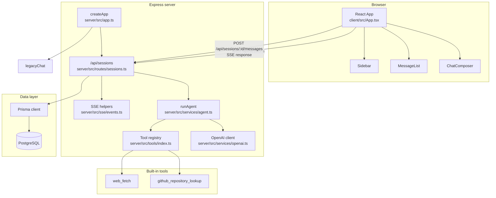
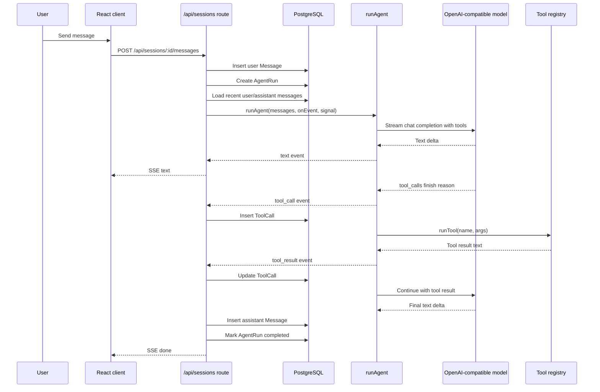
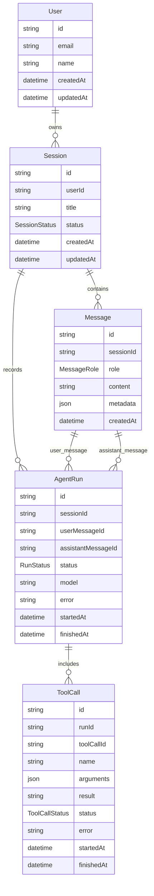

# ai-pro-agent 架构说明

本文档描述当前代码库的运行时架构。它反映的是现有实现，不包含未来规划中的 Memory、RAG、Eval、Trace UI 等模块。

## 系统拓扑



## 主请求时序



## 数据模型



## 模块职责

| 模块                            | 职责                                                                  |
| ------------------------------- | --------------------------------------------------------------------- |
| `client/src/App.tsx`            | 管理当前会话、消息列表、输入状态、发送/停止流式请求。                 |
| `client/src/lib/sessions.ts`    | 会话列表、创建会话、读取消息的 REST API 封装。                        |
| `client/src/lib/chat-stream.ts` | 解析 SSE 数据并分发 `text`、`tool_call`、`tool_result`、`done` 事件。 |
| `server/src/app.ts`             | Express 应用创建、CORS、JSON body、API 路由和生产静态文件托管。       |
| `server/src/routes/sessions.ts` | 主聊天链路：会话 CRUD、消息入库、AgentRun/ToolCall 落库、SSE 输出。   |
| `server/src/services/agent.ts`  | 拼接系统提示与历史消息，调用模型流，解析工具调用，执行工具循环。      |
| `server/src/tools/index.ts`     | 工具注册表、OpenAI tool schema 转换、参数校验和统一执行。             |
| `server/prisma/schema.prisma`   | 用户、会话、消息、运行记录和工具调用的数据模型。                      |

## 部署形态

开发模式：

```txt
Browser -> Vite dev server :5173 -> Express API :3003 -> PostgreSQL :5432
```

生产 Docker 镜像：

```txt
Browser -> Express :3003
              ├─ /api/* -> API routes
              └─ /*     -> client/dist static files
```
