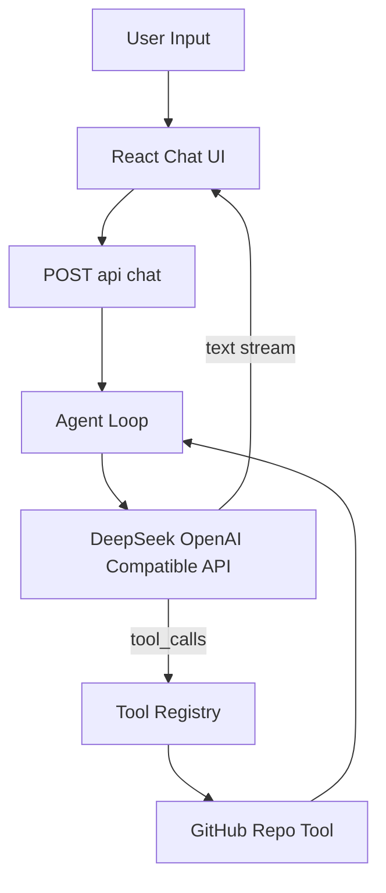

# Agent 项目演进路线

## 当前判断

你已经完成了最关键的第一步：后端在 [`/Users/zhangbowen/Downloads/ai-pro-agent/server/src/services/agent.ts`](/Users/zhangbowen/Downloads/ai-pro-agent/server/src/services/agent.ts) 里有一个流式 agent loop，能接收模型输出、解析 tool calls、执行 [`github_repository_lookup`](/Users/zhangbowen/Downloads/ai-pro-agent/server/src/tools/github.ts)，再把 tool result 放回模型上下文继续生成最终回答。

现在最明显的短板是：后端已经发出了 `tool_call` / `tool_result` 事件，但前端 [`/Users/zhangbowen/Downloads/ai-pro-agent/client/src/App.tsx`](/Users/zhangbowen/Downloads/ai-pro-agent/client/src/App.tsx) 只消费 `onText`，用户看不到 agent 在“思考/调用工具/拿到结果”的过程。另一个短板是 server/client 的事件类型重复定义在 [`/Users/zhangbowen/Downloads/ai-pro-agent/server/src/sse/events.ts`](/Users/zhangbowen/Downloads/ai-pro-agent/server/src/sse/events.ts) 和 [`/Users/zhangbowen/Downloads/ai-pro-agent/client/src/types/chat.ts`](/Users/zhangbowen/Downloads/ai-pro-agent/client/src/types/chat.ts)，后续扩展工具时容易漂移。

## 第一阶段：把 Agent 过程做可见

目标是让你能直观看到一次 agent 任务的完整轨迹，这对学习 agent 非常重要。

- 扩展 `Message` 类型，给 assistant message 增加 `steps` 或 `toolEvents`，记录工具名、参数、状态和结果预览。
- 在 `streamChatResponse` 中接上已经预留的 `onToolCall` / `onToolResult`。
- 在 `MessageList` 中展示类似“正在调用 github_repository_lookup”“已获取仓库信息”的过程卡片。
- 保留当前 HTML 回答渲染，但把工具过程和最终回答分层展示。

## 第二阶段：抽出共享协议与工具规范

目标是让新增 tool 不再牵一发动全身。

- 抽出共享的 `ServerEvent` / `Message` / `ToolEvent` 类型，避免 client/server 各自复制。
- 给 `AppTool` 增加更清晰的字段约定：`name`、`description`、`parameters`、`run`、可选的 `displayName`。
- 给工具参数加运行时校验，优先考虑轻量引入 Zod，避免模型传错参数时只靠 `JSON.parse` 和工具内部判断。
- 建立新增工具的固定流程：定义参数 schema、实现 run、注册到 `tools/index.ts`、补系统提示、补最小测试。

## 第三阶段：扩展 2 到 3 个真正有学习价值的工具

目标不是堆功能，而是覆盖 agent 常见能力类型。

- `web_fetch` 或 `url_reader`：学习外部信息获取、失败重试、内容截断。
- `repo_file_reader`：读取本地项目文件，学习上下文注入、路径安全、输出长度限制。
- `shell_lint_runner` 或 `npm_script_runner`：学习受控执行命令、超时、错误摘要和安全边界。

这三个工具能分别覆盖“联网检索”“代码上下文”“执行反馈”，比单纯继续加 GitHub API 更能帮助你理解 agent 项目的核心。

## 第四阶段：补齐工程化能力

目标是让项目从 demo 变成可以持续迭代的 agent playground。

- 使用环境变量或 Vite proxy 替代 `client/src/lib/chat-stream.ts` 中硬编码的 `http://localhost:3003/api/chat`。
- 增加客户端取消请求能力：`AbortController` + 后端已有的 `res.close` abort。
- 给 agent loop、SSE parser、GitHub tool 增加单元测试。
- 记录每次 tool 调用耗时、是否成功、迭代轮数，方便后续调试 agent 行为。

## 第五阶段：再考虑长期能力

这些不建议现在马上做，但可以作为学习路线后半段。

- 会话持久化：把对话和工具轨迹保存到数据库。
- 任务计划器：让模型先输出 plan，再逐步执行 tools。
- 多模型适配：抽象 DeepSeek/OpenAI/其他模型的差异。
- 更安全的最终输出：从“模型输出 HTML + DOMPurify”升级到结构化 JSON，由 React 组件渲染。