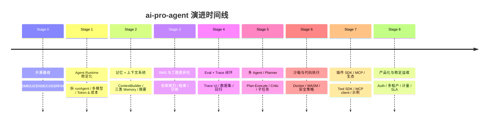

# ai-pro-agent 长期演进路线图

> 周期：约 12–18 个月，分 9 个阶段（Stage 0 ~ Stage 8）。  
> 设计原则：**每阶段独立可验收、独立可发声、独立有学习收益**。  
> 即便中途停一两个月也不会"垮"，回来能继续。

---

## 0. 写在前面

### 北极星指标（North Star）

> **"在工程协作场景下，能在不少于 80% 的真实工程问题上，给出比通用 ChatGPT 更精准、更带证据、更可追溯的回答。"**

这意味着每一阶段都要回到三个判据上：

1. **更精准** —— 上下文 / 记忆 / RAG，让 Agent 真正"理解了这个项目"。
2. **更带证据** —— 工具 / 引用 / 来源 / 代码片段，回答必须能溯源。
3. **更可追溯** —— eval / trace / 日志，能复现、能改进、能给别人证明它真的在变好。

### 项目定位（不要漂移）

- 不是"通用 AI 助手"，是 **工程方向的协作 Agent**（理解仓库、解释代码、定位 bug、做迁移建议、写文档）。
- 不是"插件市场"，是 **少量但强力的、与工程上下文绑定的工具集合**。
- 不是"另一个 ChatGPT 套壳"，是 **可以放进 GitHub README 当作 portfolio 的、工程化达标的开源项目**。

### 如何使用这份路线图

- 每个阶段都有：**目标 / 交付物 / 验收 / 学到什么 / 风险**。
- 每个阶段都对应一个"对外可发声"的成果（博客、demo 视频、PR、talk）—— 这是你开源换机会的杠杆。
- 阶段间是**乐高式拼接**，不是水管式串联。Stage 3 卡住可以跳去 Stage 4，回头补就行。
- 推荐节奏：**每阶段 4–8 周**，每周 6–10 小时投入。

### 总览图



---

## Stage 0 — 开源基线（约 1–2 周）

> 把项目变成"别人看一眼愿意 star、愿意 clone、愿意提 issue"的样子。

### 目标

- 一个陌生人 5 分钟内能跑起来。
- 一个潜在雇主 1 分钟内能看懂这是什么。

### 交付物

- `README.md`（根）：定位 + 截图 + 一句话亮点 + 快速启动 + 架构图 + 路线图链接 + License。
- `LICENSE`（MIT）。
- `CONTRIBUTING.md` + `CODE_OF_CONDUCT.md`。
- `docs/ARCHITECTURE.md`：当前请求时序图、模块拓扑图。
- `docs/screenshots/`：3 张以上高清截图。
- `.env.example` 每个字段有注释 + 申请链接。
- `docker-compose.yml`：去掉私有 registry，给出 `build: .` 与 `image: ghcr.io/...` 两种用法。
- GitHub Actions：`typecheck + lint + build`。
- `/api/health` 端点。
- 启动期 env 校验。
- Web fetch SSRF 修复。
- AbortSignal 真正传给 OpenAI SDK。

### 验收

- 把仓库分享给一个没接触过的朋友，**只看 README** 能在 10 分钟内跑起本地版。
- GitHub Actions 主分支绿色。
- `curl http://localhost:3003/api/health` 返回 `{ "status": "ok" }`。

### 学到什么

- 开源工程基础设施（CI、License 选择、issue/PR 模板）。
- 安全意识（SSRF、env 校验、最小权限）。
- 写"对外的"工程文档（架构图 / Mermaid / 时序图）。

### 对外可发声

- 一条 Twitter / 即刻 / V2EX 帖子：「我开源了一个工程方向的 AI Agent，做了什么、为什么这么做、未来怎么走」。
- 把项目放进个人简历的「Open Source」一栏。

### 风险

- 容易被「先做酷功能」诱惑跳过这一阶段。**强忍住。** 没有这一步，后面什么都白做。

---

## Stage 1 — Agent Runtime 稳定化（4–6 周）

> 把 `runAgent` 这个上帝函数拆成模块，让后面的所有东西都有地方放。

### 目标

- 模型供应商可切换（OpenAI / Anthropic / DeepSeek / OpenRouter）。
- Token 与成本精确记账。
- 工具调用、流式、取消、错误处理都有清晰边界。
- 数据库 schema 反映"运行时事实"而不是"消息列表"。

### 交付物

- 服务端拆分：
  ```
  server/src/runtime/
    agent-runtime.ts     # run 生命周期编排器
    model-client.ts      # 模型适配层（多 provider）
    stream-parser.ts     # 把不同 provider 的流统一成内部事件
    tool-runner.ts       # 执行工具 + 写库 + 发事件
    context-builder.ts   # 决定 prompt 中放什么（暂时只放近期消息）
    types.ts             # 内部事件、Run、ToolInvocation 类型
  ```
- 新的 `Provider` 抽象：
  ```ts
  interface ModelProvider {
    name: string
    stream(req: ChatRequest, signal: AbortSignal): AsyncIterable<NormalizedEvent>
  }
  ```
- Prisma schema 增加：
  - `AgentRun.inputTokens / outputTokens / costUsd / iterations`
  - `AgentRun.provider`（字符串）
  - `Session.systemPromptVersion`
- 新的 SSE 心跳事件（`: ping` 每 15s）和断流后客户端 `Last-Event-ID` 重连占位（可不实现但要预留协议字段）。
- ~~删除 `/api/chat` legacy 路由。~~ ✅ 已完成。
- 单元测试：
  - `model-client` 切换 provider 的契约测试。
  - `tool-runner` 工具失败、参数错误、超时三类用例。
  - `stream-parser` 解析 OpenAI / Anthropic 增量的 fixture-based 测试。

### 验收

- 切一行环境变量就能从 DeepSeek 切到 OpenRouter 跑通整套流程。
- 每次 run 在 DB 里能查到完整 token / cost / iteration。
- 用户点"停止"后，OpenAI 那边的请求会真的被 abort（在 OpenAI dashboard 能看到中断）。
- 测试覆盖率（server）≥ 50%。

### 学到什么

- **Agent runtime 的关键抽象**：Provider / Run / ToolInvocation / NormalizedEvent。
- 多 provider 的差异性（Anthropic 的 `tool_use` 块、OpenAI 的 `tool_calls`、DeepSeek 的 `thinking` 私有字段）。
- 流式协议的细节（SSE chunk 拼接、心跳、超时）。

### 对外可发声

- 一篇深度博客：「我把自己 Agent 项目里的 `runAgent` 上帝函数拆了，下面这 5 个模块是怎么划的」。
- 这是面试时极好的"我做过架构决策"故事。

### 风险

- 拆分时容易"过度抽象"。**口诀：拆到能写出第二个 provider 即可，停手。**

---

## Stage 2 — 记忆 + 上下文系统（4–6 周）

> 让 Agent "记得用户是谁、这个项目是什么、上次聊到哪儿"。

### 目标

- 三种记忆：`UserPreference` / `ProjectFact` / `SessionSummary`。
- 每次请求由 `ContextBuilder` 统一决定上下文构成，而不是简单拼最近 30 条。
- 不再"长会话必爆 token"。

### 交付物

- Prisma schema：
  ```
  Memory {
    id, userId, sessionId?, projectId?, kind, content, embedding vector(1536)?,
    source: enum{ USER_EXPLICIT, AGENT_PROPOSED, AUTO_SUMMARY },
    createdAt, lastUsedAt, score Float?
  }
  ```
- `MemoryService`：写入 / 检索 / 失效 / 合并去重。
- 自动会话摘要：每 N 轮（或 token 超过阈值）触发一次后台摘要任务，写入 `SessionSummary`。
- `ContextBuilder` 第一版：
  ```
  优先级：
   1. 当前用户消息
   2. 系统提示词（按"模式"选择，例如 code-explain / debug / refactor）
   3. 最近 6-8 条原始消息
   4. SessionSummary（如有）
   5. 相关 ProjectFact / UserPreference（按相关性）
   6. 工具结果摘要（如有）
  ```
- Token 预算器：按目标模型的 `contextWindow` 倒推每一层最多塞多少。
- 显式记忆管理 UI：侧边栏一个 "Memory" 抽屉，能看、能删、能加。
- "提议记忆"机制：Agent 在某些回复里返回 `proposed_memory: [...]`，前端展示成"要不要记住这条？"小卡片，用户确认才入库。

### 验收

- 100 轮以上的长会话不会爆 token，质量不显著退化。
- 用户偏好（"我用 TypeScript / 我希望中文 / 我不喜欢用 useEffect"）能在跨会话中生效。
- 提议记忆的接受率（用户点了"记住"的比例）有数据。

### 学到什么

- **上下文工程**（context engineering）的实战：什么放上面、什么放下面、怎么算预算。
- 摘要 vs 检索 vs 截断三种压缩策略的取舍。
- 显式记忆 vs 隐式记忆的产品边界（用户对"AI 偷偷记住你"是有抵触的）。

### 对外可发声

- 一篇博客：「为什么我没有用 mem0 / LangMem，而是自己手写了 Memory 层」。
- Demo 视频：连续问 20 轮，最后一轮触发了第 1 轮埋下的偏好。

### 风险

- "自动摘要" 容易丢关键事实，要在 prompt 里强制摘要保留"决策、约束、用户身份"。
- Memory 表会无限增长，必须有 TTL + 合并策略，否则成本和延迟都吃不消。

---

## Stage 3 — RAG 与工程领域差异化（6–8 周）

> 让 Agent 从"会聊"变成"会读这个项目"。这一阶段是项目最大的差异化窗口。

### 目标

- 用户可以"喂"给 Agent 一个 GitHub 仓库 / 一个文档 / 一组 URL，Agent 后续回答都能引用。
- 回答里**永远带引用**（文件路径 + 行号 + 链接）。
- pgvector 真正用起来。

### 交付物

- Prisma：
  ```
  Document { id, kind, source, title, url, ownerId, projectId, createdAt }
  DocumentChunk { id, documentId, ordinal, content, embedding vector(1536), tokens, metadata }
  Citation { id, messageId, chunkId, score }
  ```
- 数据接入：
  - GitHub repo loader：抓 README / package.json / 目录树 / 选定源码（按扩展名白名单），分 chunk 入库。
  - URL loader：用 `web_fetch` 升级版抓主体，提取标题/作者/正文。
  - PDF loader（用 `pdf-parse`）。
- 切分策略：
  - 文本 ~800 token，重叠 100 token。
  - 代码按 AST/函数边界（`tree-sitter`），保留行号 metadata。
- Embedding：默认 `text-embedding-3-small`（OpenAI）或 `bge-m3`（本地化路线，可选）。
- 检索：
  - pgvector `cosine` + `ivfflat` 索引。
  - 混合检索（向量 + BM25）：用 `tsvector` 做关键词召回，再用 `RRF` 合并。
- ContextBuilder 升级：把检索结果放在 "Retrieved Knowledge" 段，每条带 `[doc#chunk]` 编号。
- 前端引用气泡：
  - 回答末尾自动列出 `<cite data-chunk="...">` 来源，hover 可预览，点击跳 GitHub。
- 系统提示更新：明确要求"凡引用必标注 chunk id；如检索结果为空，必须说明"。

### 验收

- 用户给一个陌生 GitHub repo（< 5MB 源码），Agent 能正确回答"鉴权在哪/启动命令/某接口实现位置"。
- 回答里的引用点击能跳到原文件正确行附近。
- 检索 P50 < 200ms，整体首字 < 1.5s。

### 学到什么

- chunking 策略对结果质量的巨大影响（代码 vs 文档完全不同）。
- 混合检索 / 重排（reranker）的工程实现。
- pgvector 调参（`lists` / `probes` / `hnsw m/ef`）。
- 长文档摘要 + 多跳检索（multi-hop）。

### 对外可发声

- 一篇硬核博客：「为什么对代码做 RAG 一定要用 AST 切分，纯文本切分会丢什么」+ 配 benchmark 数据。
- 一个 demo：把 React / Next.js / 自己写的 lib 喂进去，提问然后展示引用。

### 风险

- **不要做"通用 RAG"**，专门优化"代码 + 工程文档"两种来源就够了。
- Embedding 成本会快速上升，注意做去重 + 增量更新（按 git sha / etag）。

---

## Stage 4 — Eval + Trace + Observability（4–6 周）

> 没有这一步，前面所有改进都是玄学。这一阶段是**让你"配得上"做后续阶段**的前置。

### 目标

- 能复现任何一次 run。
- 有一个回归数据集，每次改完 prompt / context / 模型，能自动跑出对比。
- 有一个 trace UI，调试 Agent 像调试 Web 后端一样直观。

### 交付物

- `EvalCase` / `EvalRun` schema：
  ```
  EvalCase { id, suite, input, expected, rubric, tags }
  EvalRun { id, caseId, runId, score, passed, judgeNotes }
  ```
- 跑评估的 CLI：`pnpm eval --suite repo-qa --commit HEAD`，跑完写库 + 生成 markdown 报告。
- 两种打分器：
  1. **Rule-based**：检查回答里是否包含 `expected.includes` / 引用是否非空。
  2. **LLM-as-Judge**：用更强的模型按 rubric 给 1–5 分。
- Trace UI（前端 `/runs` 子页面）：
  - 时间轴：每个 token、每个工具调用、每次 context 决策。
  - 输入/输出/中间提示词 diff。
  - 失败 run 一键复跑（带"换模型/换 prompt"参数）。
- 与 GitHub Actions 集成：PR 跑指定 suite，把分数 diff 评论到 PR。
- 选配：接 OpenTelemetry 导出到本地 Jaeger / Honeycomb。

### 验收

- 30 个以上 eval case 跑通。
- 每个 case 的"通过率随时间变化"图能直接挂在 README。
- PR 里有"eval diff"评论格式。

### 学到什么

- **AI 产品的工程化核心**：eval 和 trace 是真正把 Agent 从 toy 变成 product 的环节，这是最稀缺的技能之一。
- LLM-as-Judge 的偏差与对齐（rubric 怎么写、judge 模型怎么选、偏置怎么去）。
- 观测性思维（trace / span / 因果追踪）。

### 对外可发声

- 这是**整个项目最值钱的博客素材**：「我给自己的 AI Agent 做了一套 eval 平台，半年后回看跑分变化是这样的」。
- 找工作时这一阶段的代码和数据图，比写 100 个工具更有说服力。

### 风险

- 容易做成"漂亮的 dashboard，没有人在用"。**每周自己用一次，否则不算交付。**
- LLM-as-Judge 的成本可能上来，注意只在 PR / 主分支跑。

---

## Stage 5 — 多 Agent / Planner / Critic（6–8 周）

> 单 Agent 的能力天花板已被 Stage 1–4 推得很高了，这时候才适合上多 Agent。

### 目标

- Agent 能把一个复杂问题拆成子任务，逐个执行，最后整合。
- 引入"规划者—执行者—审查者"的三角色或更轻的"Plan-Execute"两角色。
- 子 Agent 之间的状态通过显式 `Task` 模型管理，而不是嵌套消息。

### 交付物

- 新表：
  ```
  Plan { id, runId, goal, steps Json, status }
  Step { id, planId, ordinal, kind, input, output, status, agent }
  ```
- `PlanningAgent` 模式：用户问复杂问题时，先输出一个 plan（前端展示成 checklist），再逐步执行。
- `CriticAgent`：每个 step 完成后跑一遍"它真的解决了 step 的目标吗"的自检。
- 前端：
  - 顶部 plan 进度条（"Step 2/5: 阅读 server/src/routes/sessions.ts"）。
  - 用户可以打断、修改 plan。
- 路由：
  - `/api/runs/:id/plan` 看完整 plan tree。
  - `/api/plans/:id/step/:idx/retry` 重跑某一步。

### 验收

- 一个"帮我重构 server/src/services/agent.ts"这种复杂请求，能自动拆成 5–10 步并跑完。
- 中途取消任意一步，剩余步骤不会乱。
- eval suite 里能加入"多步任务通过率"指标。

### 学到什么

- **Plan-Execute / ReAct / Reflexion / Tree of Thoughts** 这些 paper 在工程上的真实落地难度。
- 多 Agent 之间的状态共享与隔离设计。
- "什么时候不要上多 Agent"（**大多数时候**）。

### 对外可发声

- 博客：「我让 Agent 做 plan-execute，发现一半的失败不是模型问题，是状态机问题」。

### 风险

- 容易做成"AutoGPT 早期那种花哨但跑不通的东西"。**严格限制：每个 plan 步数 ≤ 8，任何一步失败 2 次就停。**

---

## Stage 6 — 沙箱与代码执行（6–8 周）

> 让 Agent 不只是"说"，能"做"——但安全地做。

### 目标

- Agent 可以运行用户/它自己生成的代码片段（Python / Node），并把结果作为下一步上下文。
- 可以做"读这个 repo + 写一个补丁 + 在沙箱里跑测试"。
- 沙箱是真隔离，不靠运气。

### 交付物

- 两种沙箱后端，至少实现一种：
  1. **Docker exec** —— 每次 spawn 一个 ephemeral 容器，挂载只读 / tmpfs，超时强杀。
  2. **WASM / V8 isolate** —— Node 侧用 `isolated-vm`，更轻但能力受限。
- 新工具：
  - `code_run`（参数：language, code, files?, timeout, networkAllowed=false）。
  - `apply_patch`（参数：repoId, diff）。
- 资源限制：CPU / 内存 / 磁盘 / 网络 / 时间。
- 审计：每次代码执行写 `AuditLog`，包含 hash、行数、stdout 摘要。
- 前端：执行结果折叠卡片，能看 stdout/stderr/files diff。

### 验收

- 跑一个 demo："读 README，写一个用 Express 的 hello-world，跑通，把响应贴回来。"
- 安全测试：尝试 `rm -rf /` / 访问内网 / 跑 `while(1)` 都被阻断且记录。

### 学到什么

- 容器安全 / seccomp / AppArmor / 网络 namespace。
- "工具" → "能力 (capability)" 的权限模型。
- 把 LLM 输出当作不可信输入的全套防御思路。

### 对外可发声

- 「我给我的 AI Agent 做了沙箱，能跑代码不会炸——这是我把它隔离起来的方式」。
- 在简历上「写过一个支持 sandboxed code execution 的 Agent」分量很重。

### 风险

- **这一阶段安全踩坑代价最大**，做之前先把"沙箱关掉时项目仍然好用"做为约束（即代码执行是 opt-in 工具，默认关闭）。

---

## Stage 7 — 插件 SDK / MCP / 生态（6–8 周）

> 让别人能扩展你的项目，是开源吸引贡献者的最大杠杆。

### 目标

- 第三方能用 < 50 行代码写一个新工具并插入。
- 项目作为 MCP client，可以挂载任意标准 MCP server。
- 至少 3 个社区贡献的工具示例。

### 交付物

- `@ai-pro-agent/tool-sdk`（独立 npm 包）：
  ```ts
  export const myTool = defineTool({
    name: "search_npm",
    description: "...",
    args: z.object({ query: z.string() }),
    async run({ query }, ctx) {
      // ctx 提供 logger / db / session / abortSignal
      return { ... };
    }
  });
  ```
- 工具加载机制：
  - 内置工具继续存在 `server/src/tools/`。
  - 外部工具通过 `tools.config.json` 声明（npm 包名 + 配置），启动时动态 import。
- MCP client：
  - 在 `server/src/runtime/mcp/` 实现标准 MCP 协议 client。
  - 启动时连上配置的 MCP server，把它们的 tools 注册成内部工具。
- 示例插件仓库（独立 repo）：
  - `tool-jira`、`tool-linear`、`tool-confluence` 各一个。
- 文档：`docs/build-a-tool.md` 5 分钟教程。

### 验收

- 写一个新工具从 0 到能用，**真实计时 ≤ 30 分钟**。
- 至少接入 1 个公开 MCP server（例如 filesystem / git）。
- 文档跟样例工具放在 repo 顶层 visible 位置。

### 学到什么

- 公开 SDK 的设计取舍（强类型 / 错误处理 / 版本兼容 / breaking change 政策）。
- MCP 协议本身（这是 2025–2026 极重要的标准）。
- 插件系统的安全模型（沙箱 / 权限 / 配置授权）。

### 对外可发声

- 单独发一个 `tool-sdk` 包到 npm，README 写"5 分钟给 AI Agent 写一个工具"。
- 在小型 meetup / 公司内部分享。

### 风险

- "插件市场"是开源项目的甜蜜陷阱：建好平台没人用。**先做 SDK，不做 marketplace；marketplace 等社区真有 5+ 个工具再说。**

---

## Stage 8 — 产品化与稳定运维（持续）

> 把项目从"个人作品"推到"小团队可以放心用"。

### 目标

- 正经的鉴权与多租户。
- 计量（token / 工具次数 / API 调用）。
- 部署一键化、监控告警齐全、文档跟得上。

### 交付物

- Auth 接入（三选一）：`Auth.js` / `Lucia` / `Clerk`（看你愿意维护多重）。
- 多租户隔离：`Workspace` 模型，所有现有表加 `workspaceId`。
- 计量与配额：每用户/每工作区有日额度，超额拒绝。
- Billing 占位（不要做 Stripe，做"用量看板"够了）。
- 部署模板：
  - Vercel / Railway / Fly.io 一键模板。
  - K8s helm chart（可选）。
- 监控：Sentry（前端 + 后端）、Plausible / Umami（可选）。
- 多语言（中文 + 英文）。
- 状态页（`status.ai-pro-agent.dev` 或 GitHub Pages）。

### 验收

- 一个小团队 (5 人) 试用一周，没有出现导致回滚的事故。
- "新人 → 注册 → 首次成功对话" 漏斗 P75 < 5 分钟。
- 主要错误 24 小时内被告警捕获。

### 学到什么

- SaaS 工程化全套（Auth / 多租户 / 计量 / 监控）。
- "工程师产品" 与 "消费者产品" 的距离。

### 对外可发声

- 一篇"开源项目跑了一年踩了哪些坑" 长文。
- 这是申请 AI 公司岗位时**最强**的故事载体。

### 风险

- 维护负担会指数上升。**在 Stage 8 前，请确认你愿意把这个项目当成一个长期副业**——否则停留在 Stage 4 / 5 也是优秀的成果。

---

## 1. 横向：贯穿所有阶段的工程纪律

这些不是某一阶段才做的，是从 Stage 0 开始就要养成的习惯：

### 1.1 每周节奏

| 周内时间          | 做什么                                                   |
| ----------------- | -------------------------------------------------------- |
| 周一 1h           | 看上周 trace / eval 报告，决定本周最重要的 1 件事        |
| 周二–周五 各 1.5h | 实现 + 测试                                              |
| 周六 2h           | 写一段 "本周变更" 到 `CHANGELOG.md`，必要时发推/博客片段 |
| 周日 0.5h         | 整理 issue / 回复 PR（开源后）                           |

### 1.2 每月节奏

- 月初：更新 `docs/metrics.md` 中各项数字。
- 月中：重读自己的 `roadmap.md`，删/改/加阶段。
- 月末：写一篇月度博客（哪怕只有自己看），形成持续输出习惯。

### 1.3 反目标（**不要做**）

- 不要追新模型每次更新都换底层（除非有 eval 证明对你这个 suite 提升）。
- 不要追 UI 视觉细节超过 1 天/周。
- 不要给自己设"100 个工具"的目标——10 个深的胜过 50 个浅的。
- 不要做"通用 / 全能 / 万物 Agent"。永远说"工程方向"。

### 1.4 开源运营动作（Stage 0 之后持续）

- 每次发版（git tag）写 release note。
- 接到 issue 24h 内回复（哪怕只是 "看到了，本周处理"）。
- 把每个被 close 的 issue 都写一句"是怎么修的"，攒成 Q&A 文档。
- 主动向 awesome-list / hn / reddit r/MachineLearning / r/LocalLLaMA 投放阶段性博客。
- 加入两三个 AI Agent 相关的小型 Discord / Slack（OpenAgents、LangChain、Continue.dev 都行），不潜水，混眼熟。

---

## 2. 学到的技能 → 简历映射

把这份路线图当作 **2 年的简历素材生成器**：

| 阶段    | 简历可以怎么写                                                                                                                             |
| ------- | ------------------------------------------------------------------------------------------------------------------------------------------ |
| Stage 0 | "Open-sourced & maintained an AI engineering agent on GitHub"                                                                              |
| Stage 1 | "Built a multi-provider model abstraction supporting OpenAI / Anthropic / DeepSeek with token & cost accounting"                           |
| Stage 2 | "Designed a 3-layer memory system (user / project / session) with token-budget-aware context builder"                                      |
| Stage 3 | "Implemented hybrid retrieval (BM25 + pgvector) over codebases with AST-aware chunking, achieving X% answer accuracy on internal eval set" |
| Stage 4 | "Built an LLM eval & trace platform with regression tests in CI; LLM-as-Judge rubric ..."                                                  |
| Stage 5 | "Implemented a Plan-Execute multi-agent workflow with Critic verification"                                                                 |
| Stage 6 | "Designed a sandboxed code execution layer (Docker + seccomp) for safe Agent-generated code"                                               |
| Stage 7 | "Authored a tool SDK + MCP client; X community-contributed tools shipped"                                                                  |
| Stage 8 | "Productized to multi-tenant SaaS with auth, quotas, monitoring; X active workspaces"                                                      |

任一阶段单独拎出来，都是面 AI infra / agent / dev tools 岗位的硬通货。

---

## 3. 给自己的话

- **你不是在做"另一个 ChatGPT 套壳"**，你在做一个**会读你这个仓库、能 cite 你写过的代码、能复现并改进自己回答**的工程协作 Agent。
- **不要在 eval 之前频繁换 prompt**。Stage 4 之前所有 prompt 优化都是直觉，Stage 4 之后才是数据。
- **每阶段写一篇博客**。开源最大的杠杆是你写出来的文字，不是你 push 出去的代码。
- 这份 roadmap 写于 2026-05。明年这个时候你会回来重写它，那时候删一半、加另一半都是正常的。
- **跑得动比跑得快更重要**。每周 6 小时连续 1 年，比每月一波 80 小时强 10 倍。
